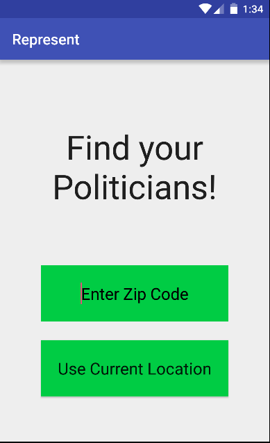
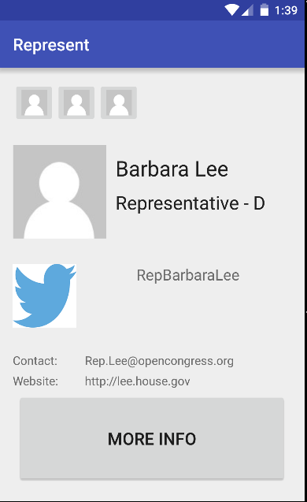
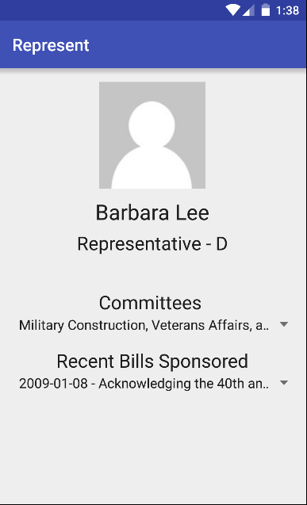
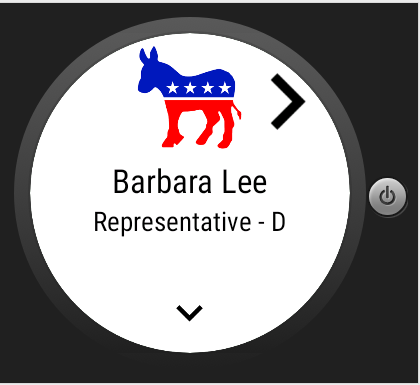
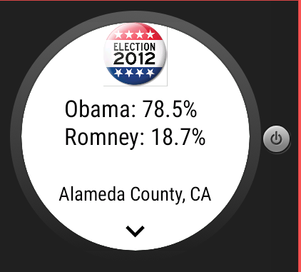

# PROG 02: Represent!

This app is a class project for CS 160 Spring 2016 at UC Berkeley.
This app, given your current location or a zip code, will find your Senators and Representatives, display them both on your phone and smart watch, present their voting record, and show your county's voting data from the 2012 election.

## Authors

Jaskirat Mahal ([jmahal@berkeley.edu](mailto:jmahal@berkeley.edu))

## Demo Video

See [Prog 2C] (https:youtu.be/u9eX4oyRJHg)

## Screenshots

## Acknowledgments

* Hat tip to Brandon Chinn for the parsed election data and Obaro Ogbo
* And my thanks to the staff
